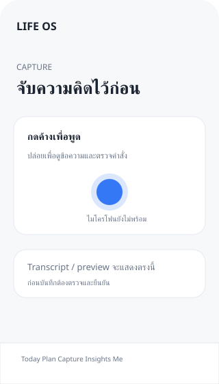

# Voice Capture design checkpoint

Status: phase-1 shell and design checkpoint only (2026-10-05). The design follows the approved roadmap; the real microphone, transcript, AI and write flow remains unimplemented and is not ready for acceptance.

## Baseline audit (1.1)

- Routes already present: login/callback; authenticated Today, Plan, Capture, Insights and Me; an offline page. Each app page uses `AppFrame` and the `(app)` server layout checks `auth.getUser()` before rendering.
- Reuse: keep `Navigation`, `AppFrame`, the server session guard, and current CSS tokens. Keep `/capture` as a normal navigation route; do not make its link a recording trigger.
- Current capture is a simple page with a text area and disabled save button. There is no microphone, transcription, command API, preview/confirm, or persistence path.
- Tooling baseline: Next 16 / React 19 / TypeScript 5.8, Vitest 3, Supabase SSR/client. Vitest previously selected only `src/**/*.test.ts`; TypeScript previously omitted `model/contracts` from `include`. Both are adjusted by this phase-1 work.
- Boundaries: keep auth protected in the server layout. `CaptureProvider` is mounted only after session verification and is keyed by `user.id`; it supplies an unavailable state and cleanup registry only.

## Shared app shell

- Keep `src/app/(app)/layout.tsx` as the server-side authentication boundary. It must continue to call `auth.getUser()` and redirect missing sessions to `/login`.
- The server protected layout mounts one client `CaptureProvider` after verifying the user. It exposes an `unavailable` capability state and a cleanup callback registry for a future session. It does not start recording or show a live recording control.
- `AppFrame` remains the shared page chrome used by Today, Plan, Capture, Insights and Me. Bottom navigation remains the existing `/capture` link and appearance; it does not start recording.
- `/capture` remains the place for a future transcript, clarification, preview, result and error flow. The present text area is a non-persisting placeholder; saving remains disabled.

## Proposed interaction (not implemented)

1. Pointer/touch or keyboard press-and-hold requests microphone permission and starts one session. UI shows a clear listening state only after permission and recorder startup succeed.
2. Releasing the hold stops recording and submits the audio once to the authenticated server pipeline. Explicit cancel, route change, logout, permission denial, interruption and component teardown stop tracks and clear transient audio.
3. Server transcription produces editable text. A command interpreter may ask for missing fields or return an answer; it cannot write records directly.
4. Mutations appear as a reviewable proposal. Only an explicit user confirmation executes an owner-scoped server command. Duplicate submissions and late responses must not execute twice or revive a cancelled session.
5. The result links to the saved record and refreshes affected views. Errors preserve safe, recoverable text and never claim a save that did not succeed.

## Visual checkpoint for 1.2 (concept only)

The existing app CSS supplies the starting tokens. This sketch adds an interaction placement for review; it is not a request to redesign every screen or to enable the control.

| Token | Current value |
|---|---|
| Page background / surface | `#f7f8fa` / `#ffffff` |
| Text / secondary text | `#1b2430` / `#687385` |
| Accent / soft accent | `#3478f6` / `#e9f0ff` |
| Font | system UI, with Apple system font on iPhone |
| Spacing | 10px navigation inset, 16px mobile page gutter, 20px card padding, 24px top bar padding |
| Shape | 12px form/button radius, 18px card radius |

Static mobile layout concept (illustrative; bottom navigation styling is unchanged):

## Boundaries and acceptance still pending

- `src/features/capture/capture-controller.ts` defines only the future controller boundary; `capture-provider.tsx` is the mounted shared cleanup boundary. No concrete controller or microphone API exists.
- Voice pipeline, consent semantics, recorder/audio retention, provider selection, runtime validation, API routes, idempotency, preview/confirm, and Today/Plan refresh need implementation and tests in phases 2–4.
- Before exposing a shared hold control, test a single session across every protected route, cancel/logout/navigation cleanup, denied and interrupted microphone permissions, duplicate release/request behavior, transcript editing, late responses, explicit confirmation, account isolation, mobile safe areas and keyboard/accessibility behavior on supported devices.
- No final visual redesign is implied by this checkpoint; use it to review the structure and interaction before actual recording work.

## Verification for this checkpoint

- `npm test`: passed, 4 test files / 18 tests.
- `npm run typecheck`: passed, including `model/contracts/**/*.ts`.
- `npm run lint`: passed with 0 errors and 1 pre-existing warning in `eslint.config.mjs`.
- `npm run build`: passed.
- `node scripts/smoke.mjs`: passed, 4 route checks.
- No remote SQL tests or physical-device microphone tests were run. These results verify repository behavior only and do not mean Voice Capture or actual session/audio cleanup is ready for acceptance.
