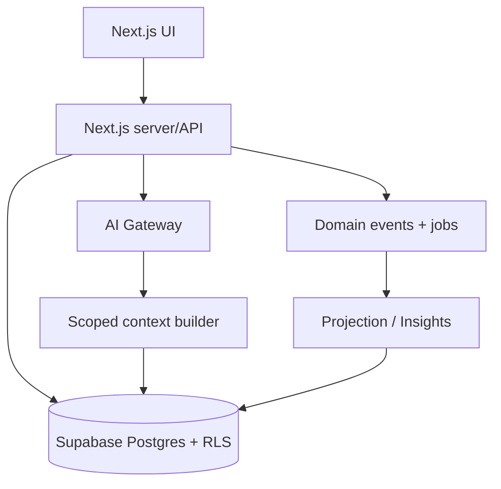

# LIFE-OS Architecture

สถานะ: foundation deployed and verified (2026-09-22)  
ขอบเขต: โครงระบบที่ทำให้ข้อมูลจากทุก section (รวม section ที่จะเพิ่มภายหลัง) อยู่ใน graph เดียวกัน โดยไม่ผูก implementation เป็นคู่ ๆ ระหว่าง section

## 1. เป้าหมายและหลักการ

- ทุก record มี owner เป็น `user_id` และมี identity ของแหล่งข้อมูลครบ จึง deduplicate, trace และ revoke ได้
- section เป็น producer/consumer ผ่าน contract กลางเดียวกัน ไม่เรียกฐานข้อมูลของ section อื่นโดยตรง
- การเชื่อมโยงมีระดับความมั่นใจและที่มา ข้อมูลจะถูกนำไปสัมพันธ์กันเมื่อมี assertion ที่ยืนยันแล้วหรือมี mapping ที่ระบบพิสูจน์ได้ตามกฎที่ประกาศไว้ ระบบไม่ถือว่าทุกความสัมพันธ์มีความหมายโดยอัตโนมัติ
- การอ่านข้อมูลทุกครั้ง scope ด้วย owner, permission และ filter ที่ผู้ใช้ร้องขอ
- raw input เก็บใน `entity_records.payload`/typed rows ระยะแรก; แยก canonical facts เป็น future extension เพื่อแก้ parser, audit และย้อนกลับได้

## 2. Topology



### Components

| ส่วน | หน้าที่ | กฎสำคัญ |
|---|---|---|
| Next.js UI | Capture, Today, Plan, Insights, Me | ใช้ authenticated Supabase client + RLS สำหรับ CRUD ที่ตรงไปตรงมา; ใช้ server/API สำหรับ orchestration และงาน privileged |
| Next.js server/API | auth, validation, orchestration, transaction | ใช้ user session; ห้ามรับ `user_id` จาก client เป็นตัวตัดสินสิทธิ์ |
| Supabase Postgres | profiles, sections, section_permissions, entity_records, typed section tables, entity_links, time_blocks | เปิด RLS ทุกตารางที่มีข้อมูลผู้ใช้ |
| Domain event/job | กระจายการเปลี่ยนแปลงและงานหนัก | event มี idempotency key; retry ได้ (future event layer) |
| AI Gateway | เรียก model และกำหนด policy/งบ token | ส่งเฉพาะ context ที่ผ่าน scope; ไม่ให้ model query DB เอง |
| Context builder | แปลง graph ที่ scope แล้วเป็น facts พร้อม provenance | จำกัด section, time range, relation confidence ตามคำขอ |

## 3. สัญญากลางของข้อมูล

ใช้ TypeScript schema (เช่น Zod) เป็น source of truth และ generate DB/API types:

```ts
type SectionKey = string; // e.g. "tasks", "calendar", "health", "finance"
type RecordIdentity = {
  section: SectionKey;
  entityType: string;
  sourceId: string;       // id ภายใน section/connector
  userId: string;         // จาก authenticated session
  canonicalEntityId?: string;
};
type Provenance = {
  source: "user_input" | "integration" | "derived" | "ai_extracted";
  sourceRecord?: RecordIdentity;
  observedAt: string;
  importedAt: string;
  extractorVersion?: string;
};
type SectionEnvelope<T> = {
  schemaVersion: number;
  identity: RecordIdentity;
  occurredAt?: string;
  validFrom?: string;
  validTo?: string;
  payload: T;
  provenance: Provenance[];
  visibility: "private" | "shared";
  tags?: string[];
};
```

ทุก section ต้องประกาศ `SectionManifest` ได้แก่ `sectionKey`, entity types, JSON schema, commands/queries ที่รองรับ, event types, sensitivity class, retention และ mapping rules ที่อนุญาต การเพิ่ม section ใหม่จึงเพิ่ม manifest/adapter และไม่แก้โค้ดของ section เดิมเพื่อเชื่อมเป็นรายคู่

## 4. Typed contract สำหรับ fact/metric/time block

ทุก section adapter ต้องแปลงข้อมูลเข้า shape เดียวจาก `model/contracts/index.ts`: `TypedFact` (key, value, valueType, observedAt), `Metric` (metric, numeric value, unit, periodStart/periodEnd, dimensions) และ `TimeBlock` (startsAt, endsAt, status, source). แต่ละรายการมี `identity` และ `ownerUserId`; owner ต้องตรงกับ session/RLS. ค่า `FactValue` ห้ามใช้ object อิสระโดยไม่ประกาศ `valueType`. `Metric` ต้องมีหน่วยและช่วงเวลาเสมอ. `TimeBlock` ใช้ ISO timestamp และ interval แบบ `[startsAt, endsAt)`; contract status คือ `busy|tentative|available`. Deployed schema เก็บ `time_blocks.status` เป็น `planned|cancelled`; adapter ต้อง map `planned` เป็น `busy` หรือ `tentative` ตาม `kind/metadata` ที่ประกาศ และต้องกรอง `cancelled` ออกจาก conflict calculation. สถานะที่ไม่รู้จักถูกปฏิเสธด้วย check constraint. Correlation ใช้เฉพาะ fields ที่ manifest ระบุและกฎ deterministic ที่มีหลักฐาน; ห้ามใช้ชื่อ/เวลาใกล้กันเป็น magic automatic link.

## 5. โมเดลฐานข้อมูล

ตารางที่มีใน migration 001 (ใช้งานได้ระยะแรก):

- `profiles(user_id, display_name, timezone, created_at, updated_at)`; timezone เริ่มต้นเป็น `Asia/Bangkok`
- `sections(id, key, name, version, schema, active)` และ `section_permissions(user_id, section_id, can_read, can_write)` (ใช้เป็น consent สำหรับ AI/service layer; ไม่ใช่การเปิดอ่าน DB แทน RLS)
- `entity_records(id, user_id, section_id, entity_type, source_id, title, payload, valid_from, valid_to, created_at, updated_at)`; unique `(user_id, section_id, entity_type, source_id)` เป็น canonical index ของ object ทุก section
- typed tables ระยะแรก: `tasks`, `events`, `workouts`, `health_measurements`, `finance_transactions`, `finance_entries`; ทุก row อ้าง `entity_records` ผ่าน `entity_id`
- `entity_links(id, user_id, source_entity_id, target_entity_id, relation_type, metadata)` เป็นช่องทาง link ข้าม section เดียว
- `time_blocks(id, user_id, entity_id?, starts_at, ends_at, kind, status, metadata)`

Foundation ปัจจุบันมี 12 ตารางใน `public` และ seed catalog 4 ค่า: `tasks`, `calendar`, `health`, `finance`. Trigger บังคับให้ typed rows อ้าง canonical record ที่มี owner, section และ entity type ถูกต้อง; canonical identity `(user_id, section_id, entity_type, source_id)` เปลี่ยนภายหลังไม่ได้. Finance transaction ต้องมีอย่างน้อยสอง entries และยอดรวมศูนย์ก่อน commit.

ตารางต่อไปนี้เป็น **future extensions** และยังไม่มีใน migration 001: `facts`, `metrics`, `canonical_entities` แยกต่างหาก, `domain_events`, `projection_checkpoints`, read models (`today_items`, `insight_cards`), `permissions` แบบแชร์ละเอียด และ `ai_runs`. ระยะแรกให้เก็บ fact/metric ใน typed section payload/ตารางที่มีอยู่ พร้อม provenance ใน payload/metadata; เมื่อเพิ่มตารางต้องคง contract และ RLS เดิมไว้.
`entity_records.id` เป็น canonical ID ของ object ระยะแรก และ `entity_links` trace ความสัมพันธ์กลับไปยัง endpoints ได้เสมอ การ merge identity เป็น future workflow ต้องมี evidence และบันทึก metadata/audit; ห้าม overwrite payload ต้นทาง

## 6. Identity, links และความหมายข้าม section

Identity ขั้นต่ำในทุก API/DB record คือ `(section, entityType, sourceId, userId)`; `sourceId` ตรงกับ `entity_records.source_id` ซึ่งบังคับ, unique ต่อ `(user_id, section_id, entity_type, source_id)` และ immutable หลังสร้าง; `entity_records.id` เป็น canonical internal ID โดย `canonicalEntityId` เป็น optional และห้ามใช้ข้าม owner. ใน foundation ปัจจุบัน `entity_links.metadata` ยังไม่มีคอลัมน์บังคับสำหรับ status/confidence/evidence; ช่วงแรกให้ถือ link ที่สร้างโดย user เป็น asserted และเก็บ metadata convention แบบ versioned เท่านั้น. สถานะ `proposed|confirmed|rejected`, confidence และ evidence ที่ schema บังคับเป็น future extension. Link สร้างได้จาก:

1. `asserted`: ผู้ใช้สร้าง/ยืนยันเอง พร้อม provenance
2. `confirmed`: adapter หรือ deterministic rule จับคู่ได้ตาม mapping ที่ manifest ประกาศ เช่น external ID เดียวกัน
3. `derived`: correlation engine เสนอจากเวลา, tags, ตัวเลข หรือ semantic signal พร้อม confidence และ evidence; ต้องไม่ถูกนำเสนอเป็นข้อเท็จจริงจนกว่าจะยืนยันตาม policy

Relation มีชื่อและ schema (`supports`, `scheduled_for`, `caused_by`, ฯลฯ) แต่ถ้าไม่อยู่ใน registry ให้เป็น `unknown` และไม่ใช้ใน automation สำคัญ. ทุก query ระบุ `owner=user_id`, section/entity filters, time range, link status และ minimum confidence; default อ่านเฉพาะ owner เดียวและ `asserted|confirmed`.

## 7. เส้นทางข้อมูลหลัก

### Capture → Today/Plan

1. UI ส่ง `CreateRecord` ผ่าน authenticated Supabase client หรือ server/API พร้อม section/entityType/sourceId/payload; server เติม user จาก session และ validate manifest
2. transaction insert/update `entity_records` และ typed row ของ section; normalize `time_blocks` (ถ้ามี). Event/outbox และ idempotency เป็น future extension; ระยะแรกใช้ request id ที่ service layer
3. Today/Plan query `entity_records`, typed tables และ `time_blocks` โดยตรงตาม owner/timezone; projection/read models เป็น future extension
4. Today/Plan ลิงก์กลับ `entity_records` เพื่อแก้ไข; read model เป็น future optimization

### Capture → AI → Insights

1. ผู้ใช้ถามหรือขอ insight พร้อม `sectionFilters`, `from/to`, `relationPolicy`
2. context builder ตรวจ `section_permissions` เป็น AI consent แล้ว query `entity_records`/typed tables/links เฉพาะ scope; แนบ provenance และ confidence ตาม typed contract (ตาราง facts แยกเป็น future extension)
3. AI Gateway ส่ง structured context ให้ model Luna/โมเดลที่กำหนด พร้อม output schema (answer, citedFactIds, suggestedActions)
4. server ตรวจ cited IDs, ห้าม model สร้าง fact ใหม่โดยตรง; suggestion ที่จะเปลี่ยนข้อมูลต้องเป็น command ให้ผู้ใช้ยืนยัน
5. บันทึก AI audit แบบที่มีอยู่ใน service log อย่าง redact; `ai_runs` และ insight card เป็น future extension

### Cross-section correlation

Correlation engine (future extension) consume typed payloads/ออกแบบ event จากทุก section แล้วใช้ manifest mapping registry เสนอ `proposed entity_links` หรือ `derived facts`; migration 001 ยังไม่มีสถานะ/ตารางสำหรับจัดเก็บ proposal แบบบังคับ schema ไม่เขียนตาราง section อื่น ไม่ทำ pairwise adapter. ตัวอย่างการใช้จริงคือ calendar time block เชื่อม task/health/finance record ผ่าน canonical entity หรือ evidence ที่ตรงกัน แล้วแสดงระดับ confidence และที่มาให้ผู้ใช้ตรวจ

### Scheduling conflict

`time_blocks` ที่ adapter map เป็น `busy|tentative` ถูกนำมาเปรียบเทียบตาม owner และ timezone. overlap สร้าง warning ใน Plan (conflict event เป็น future event layer); ระบบไม่ย้ายหรือลบ block อัตโนมัติ การ override ต้องเป็น user command พร้อม metadata/provenance convention.

## 8. Trust boundaries และความปลอดภัย

- Browser → server: session cookie, CSRF protection, input/schema validation, rate limit
- Server → DB: Supabase authenticated identity + RLS; service role ใช้เฉพาะ worker ที่มี job scope
- Server → AI Gateway: redact secrets, sensitivity policy, provider logging policy, timeout/token budget
- Integration → server: per-connector token vault, verify webhook signature, idempotency
- AI output: untrusted text; validate JSON schema and cited IDs; no direct SQL/tool execution or mutation
- Logs: user_id and record IDs allowed for audit; payload/sensitive values redact ตาม section manifest

RLS policy ที่ deploy แล้ว: `auth.uid() = user_id` สำหรับ select/insert/update/delete ทุกตารางที่มี user_id รวม links/time blocks/typed rows. `section_permissions` เป็น AI/service consent ไม่ใช่ cross-user sharing และไม่แทน RLS. `anon` ไม่มีสิทธิ์บนตาราง Life OS; `authenticated` ได้สิทธิ์แบบ explicit เฉพาะตารางที่ต้องใช้. Worker (เมื่อเพิ่ม) ใช้ explicit `user_id` scope และตรวจ consent ก่อนสร้าง context/projection.

## 9. Incremental rollout

1. **Foundation**: profiles, sections/section_permissions, manifests, envelopes, RLS, entity_records, typed rows, typed API; provenance อยู่ใน payload/metadata ตาม convention
2. **First vertical slice**: tasks + calendar capture → time_blocks → Today/Plan + conflict detection
3. **Graph layer**: entity_links ที่มีอยู่, registry, แล้วค่อยเพิ่ม canonical_entities/facts และ proposed/confirmed workflow เป็น future schema
4. **AI/Insights**: scoped context builder, AI gateway, cited output; insight projections เป็น future extension
5. **Additional sections**: ขยาย health/finance จาก starter tables และเพิ่ม section ใหม่ผ่าน manifest/adapter; migration ไม่เปลี่ยน contract กลาง
6. **Hardening**: retries/checkpoints, audit, retention/export/delete, load and permission tests

## 10. ADRs ที่ต้องบันทึก

- ADR-001: envelope และ identity tuple เป็น canonical boundary
- ADR-002: source records แยกจาก canonical facts เพื่อรักษา provenance
- ADR-003: event + projection แทน synchronous section-to-section calls
- ADR-004: link states และ evidence; proposed link ไม่ใช่ fact
- ADR-005: owner-scoped RLS และ shared permission model
- ADR-006: AI เป็น read/context consumer และเสนอ command ผ่าน server เท่านั้น
- ADR-007: time zone, interval semantics และ conflict policy
- ADR-008: schemaVersion, idempotency และ migration compatibility

## 11. Acceptance criteria

- เพิ่ม section ใหม่ด้วย manifest + adapter แล้วสามารถ ingest/query typed payload โดยไม่แก้ section เดิมหรือเพิ่ม pairwise integration; event/provenance ที่บังคับ schemaเป็น future layer และระยะแรกใช้ payload/metadata convention
- record ทุกชนิดตรวจ identity tuple ได้ และ duplicate source event ไม่สร้าง record/fact ซ้ำ
- เมื่อเปิดใช้ fact/link extension แล้ว ทุก fact/link ต้องแสดง source record, observed time, confidence และ status; ใน migration 001 link ใช้ endpoint + metadata convention และห้ามตีความ metadata เป็น enforced status
- ผู้ใช้ A ไม่สามารถอ่านหรืออนุมานข้อมูลของผู้ใช้ B ผ่าน API, projection, link หรือ AI context ได้ (RLS/integration tests)
- Capture หนึ่งรายการปรากฏใน Today/Plan จาก entity_records/typed tables/time_blocks พร้อมลิงก์กลับ source; event replay เป็นเกณฑ์เมื่อ future event layer เปิดใช้
- time blocks ต่าง section ที่ overlap กันสร้าง conflict ที่ตรวจสอบย้อนกลับได้ และไม่แก้ตารางอัตโนมัติ
- AI ตอบได้จากหลาย section ตาม filter/time range พร้อม citedFactIds ที่ server ตรวจได้; action ทุกชนิดต้องผ่าน user confirmation
- เพิ่ม health/finance adapter แล้ว query เดียวสามารถคืนข้อมูลข้าม section ตาม owner/filter/confidence โดยไม่มี hard-coded pairwise code
- schema contract, migration, RLS, permission boundary และ deletion/export มี automated checks ก่อน release; event replay/fact provenance checks เพิ่มเมื่อ future layers เปิดใช้
